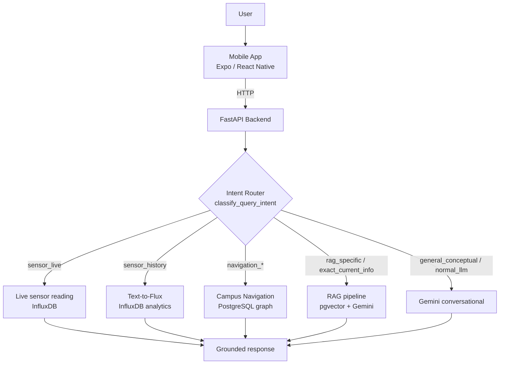

# Campus-Aware Intelligent AI Agent

A full-stack, campus-aware AI assistant built as a final-year capstone project for **La Trobe University**. Users ask natural-language questions through a mobile app and receive grounded answers about live and historical campus sensor data, university documents, and campus services.

The backend is **not a single LLM call** — it is an intent-routing orchestrator that dispatches each query to the right pipeline (live sensors, historical sensor analytics, retrieval-augmented generation, campus navigation, or a general conversational fallback), with guardrails that prevent the model from inventing official university information.

---

## What it can answer

| Example query | Pipeline |
|---|---|
| "What is the temperature right now?" | Live sensor |
| "Average humidity last week" / "Was the room hotter yesterday afternoon?" | Historical sensor (Text-to-Flux) |
| "How do I get from the Library to DW?" / "Where is the nearest bathroom?" | Campus navigation (graph DB) |
| "Summarise this policy" / "Where are student support services?" | RAG over university documents |
| "Explain what a heat index means" | General conversational (Gemini) |

---

## Tech Stack

| Layer | Technology |
|---|---|
| **Mobile** | Expo, React Native, TypeScript, Expo Router (pnpm) |
| **Backend** | FastAPI, Python 3.11+, Uvicorn, Pydantic |
| **AI** | Google Gemini (Gemini 2.5 Flash) via `google-genai` |
| **RAG** | PostgreSQL + `pgvector`, `sentence-transformers/all-MiniLM-L6-v2`, PyMuPDF |
| **Time-series** | InfluxDB 2.7 (Flux queries generated from natural language) |
| **Navigation** | PostgreSQL graph DB (96 campus locations, Dijkstra shortest path) |
| **Auth** | Firebase Authentication |
| **Infrastructure** | Docker Compose (PostgreSQL 16 + InfluxDB 2.7) |

> This project uses **Google Gemini**, not OpenAI, and does **not** use LangChain. There is no managed hosting provider — it runs locally against Dockerised databases.

---

## High-Level Architecture



See [`docs/architecture.md`](docs/architecture.md) for the full routing, RAG, Text-to-Flux, and navigation design.

### API endpoints

| Method | Path | Purpose |
|---|---|---|
| `GET` | `/health` | Service health and environment |
| `POST` | `/chat` | Main intent-orchestrated chat |
| `POST` | `/rag/chat` | Direct RAG chat endpoint |
| `GET` | `/sensor/latest` | Latest live sensor reading |

Interactive API docs are available at `/docs` (Swagger UI) when the backend is running.

---

## Repository Structure

```text
campus-aware-ai-agent/
├── backend/              FastAPI service (Python 3.11+)
│   ├── app/
│   │   ├── api/          Endpoints: chat, rag_chat, sensor
│   │   ├── services/     Routing, LLM, Text-to-Flux, sensors, navigation
│   │   ├── rag/          RAG pipeline (chunk, embed, store, retrieve)
│   │   ├── core/         Configuration and env validation
│   │   ├── schemas/      Pydantic request/response models
│   │   └── db/           Navigation bootstrap + seed SQL
│   ├── ragData/          Source PDFs ingested by the RAG pipeline
│   ├── scripts/database/ InfluxDB ingestion + maintenance utilities
│   └── tests/            Automated test suite + manual QA suite
├── mobile/               Expo / React Native app (TypeScript)
├── data/                 Sample data (e.g. campus map PDF)
├── docs/                 Project documentation
├── docker-compose.yml    Local PostgreSQL 16 + InfluxDB 2.7
└── README.md
```

---

## Quick Start

**Prerequisites:** Git, Python 3.11/3.12, Node.js 20 LTS, pnpm, Docker Desktop, and the Expo Go app on your phone.

```powershell
# 1. Start local databases (PostgreSQL on 5432, InfluxDB on 18086)
docker compose up -d

# 2. Backend
cd backend
python -m venv .venv
.venv\Scripts\Activate.ps1
pip install -r requirements.txt
# copy the root .env.example to backend/.env and fill in values (see docs/setup-guide.md)
uvicorn app.main:app --reload --host 0.0.0.0 --port 8000

# 3. Mobile (in a second terminal)
cd mobile
pnpm install
# create mobile/.env from mobile/.env.example using your laptop's IPv4 (not localhost)
pnpm expo start --clear
```

Full step-by-step setup, environment variables, and troubleshooting are in [`docs/setup-guide.md`](docs/setup-guide.md).

> **InfluxDB note:** the host port is **`18086`** (mapped to the container's `8086`). Always use `18086` in `INFLUXDB_URL`.

---

## Testing

```powershell
cd backend
.venv\Scripts\Activate.ps1
$env:SENSOR_SYNC_ENABLED = "false"   # avoids sensor-loop noise during tests
python -m pytest
```

The automated suite covers routing, Flux query safety, parsing, retries, configuration, and hallucination guardrails. See [`docs/testing-summary.md`](docs/testing-summary.md) for the full breakdown and the manual QA framework.

---

## Documentation

| Document | Contents |
|---|---|
| [`docs/setup-guide.md`](docs/setup-guide.md) | Local setup, environment variables, troubleshooting |
| [`docs/architecture.md`](docs/architecture.md) | Routing, RAG, Text-to-Flux, sensor systems, navigation, guardrails |
| [`docs/testing-summary.md`](docs/testing-summary.md) | Test coverage and QA approach |
| [`docs/rag_audit_notes.md`](docs/rag_audit_notes.md) | RAG retrieval audit (quality evidence) |

---

## Team

Capstone project, La Trobe University. Contributors: Saiful Islam Shihab (backend+AI), Ruhan (RAG+AI), Sam (frontend), Sadaat (auth+routing+security), Sneh (Documentation+QA).
