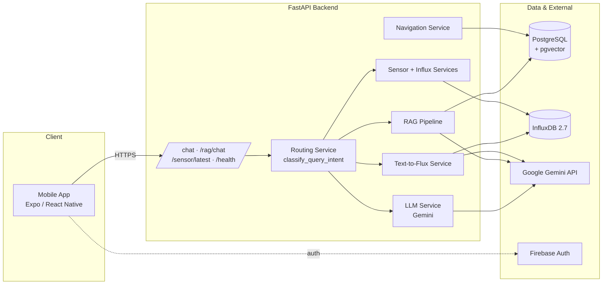
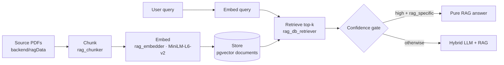

# Architecture

Campus-Aware Intelligent AI Agent — La Trobe University Capstone

This document describes how the system is structured and how a user query flows through it. The backend is an **intent-routing orchestrator**, not a single LLM call: each query is classified and dispatched to the pipeline best suited to answer it, with guardrails that prevent the model from inventing official university information.

---

## 1. System Components

| Component | File | Responsibility |
|---|---|---|
| API layer | `backend/app/api/{chat,rag_chat,sensor}.py` | Endpoints and request handling |
| Routing | `backend/app/services/routing_service.py` | `classify_query_intent()` — picks the pipeline |
| LLM | `backend/app/services/llm_service.py` | Gemini conversational + sensor responses |
| Text-to-Flux | `backend/app/services/text_to_flux_service.py` | Natural language → safe Flux queries |
| RAG | `backend/app/rag/*.py` | Chunk, embed, store, retrieve, generate |
| Sensors | `backend/app/services/{influx_sensor_service,influx_query_service,sensor_service,sensor_scheduler}.py` | Ingestion + live readings |
| Navigation | `backend/app/services/navigation_service.py` | Campus navigation data |
| Config | `backend/app/core/config.py` | Env loading + validation |

---

## 2. Request Lifecycle

```mermaid
sequenceDiagram
    participant U as User (Mobile)
    participant API as FastAPI /chat
    participant R as Routing Service
    participant P as Selected Pipeline
    participant G as Gemini

    U->>API: POST /chat { message }
    API->>R: classify_query_intent(message)
    R-->>API: intent + metadata
    API->>P: dispatch to pipeline
    P->>G: generate (where applicable)
    G-->>P: model output
    P-->>API: grounded response
    API-->>U: ChatResponse
```

---

## 3. Intent Routing

`classify_query_intent()` returns one of the following intents. **Sensor intents always take priority** over general/RAG intents.

| Intent | When | Routes to |
|---|---|---|
| `sensor_history` | Aggregates/trends/time-ranges ("average", "last week", "yesterday") | Text-to-Flux pipeline |
| `sensor_live` | Current readings ("temperature right now", "humidity now") | Live sensor pipeline |
| `exact_current_info` | Exact official facts (fees, links, calendars) | RAG with trusted-source guardrails |
| `rag_specific` | Campus-specific retrieval (buildings, policies, services) | RAG pipeline |
| `general_conceptual` | Broad conceptual/advice questions | RAG + LLM hybrid |
| `normal_llm` | Fallback conversation | Gemini direct |

---

## 4. Pipelines

### sensor_live
1. `influx_sensor_service.sync_latest_sensor_data_to_influx()` — refresh latest data
2. `influx_query_service.get_latest_sensor_reading_from_influx()` — read latest point
3. `llm_service.generate_sensor_response()` — phrase the answer

### sensor_history (Text-to-Flux)
`text_to_flux_service.answer_sensor_flux_question()` — Gemini generates a Flux query from `FLUX_SCHEMA`, which is sanitized, executed against InfluxDB, and summarized. See §6.

### exact_current_info / rag_specific / general_conceptual (RAG)
`rag_pipeline.generate_answer_with_diagnostics()` performs retrieval with confidence gating. Exact-info answers additionally pass through `_safe_exact_info_response()` and require trusted-source grounding. See §5.

### normal_llm
`llm_service.generate_response()` — a direct Gemini conversational reply.

---

## 5. RAG Architecture

Retrieval lives in `backend/app/rag/rag_pipeline.py`, backed by PostgreSQL + `pgvector` (table `documents`, column `embedding`), using `sentence-transformers/all-MiniLM-L6-v2` embeddings. Source PDFs in `backend/ragData/` are ingested via the chunk → embed → store flow.

### Confidence gating

Similarity is computed as `similarity = 1 / (1 + distance)`:

| Band | Threshold |
|---|---|
| High | `0.75+` |
| Medium | `0.62+` |
| Low | below `0.62` |

- `rag_specific` + high confidence → pure RAG response
- otherwise → hybrid LLM + RAG response

The pipeline preserves `confidence` and `context_chunks` fields, which routing, trusted-source guardrails, and hybrid responses depend on.

---

## 6. Text-to-Flux

Natural-language historical/analytical questions are converted into safe Flux queries (`text_to_flux_service.py`). `FLUX_SCHEMA` enforces strict constraints. Every generated query must:

- filter `_measurement == "sensor_readings"`
- include a bounded `range(...)` — **never** `range(start: 0)`
- `group()` before aggregates
- limit non-aggregate output with `limit(n: 20)`

These rules are enforced by `tests/test_flux_query_safety.py` and `tests/test_text_to_flux_parsing.py`. The service also handles time-range parsing, aggregation, query sanitization, formatting, and graceful no-data responses.

---

## 7. Sensor System & Ingestion Loop

Sensor fields: **temperature, humidity, pressure, dew_point**. Capabilities: live readings, averages, min/max, trends, and monthly/yearly analysis.

On startup, `app/main.py`'s lifespan launches `run_sensor_ingestion_loop()` (`sensor_scheduler.py`), which polls live sensor APIs and writes into InfluxDB.

| Env var | Default | Notes |
|---|---|---|
| `SENSOR_SYNC_ENABLED` | `true` | Set `false` during tests/offline work |
| `SENSOR_SYNC_INTERVAL_SECONDS` | `300` | Minimum `15` |

---

## 8. Hallucination Guardrails

The system deliberately prevents Gemini from inventing URLs, fees, schedules, or other official university information. When trusted grounding is unavailable, it acknowledges uncertainty and redirects users to official La Trobe resources. Guardrail behavior is covered by `tests/test_llm_guardrails.py` and `tests/test_url_ranking.py`.

---

## 9. Startup & Configuration

`backend/app/core/config.py` loads `backend/.env` and exposes a `Settings` object. The FastAPI lifespan (`app/main.py`):

1. Validates required env vars in `production`/`staging` (`validate_required(strict=True)`)
2. Ensures campus navigation data is ready (`ensure_navigation_data_ready()`)
3. Launches the sensor ingestion loop

PostgreSQL accepts both `POSTGRES_*` and `DB_*` naming styles; `config.py` mirrors one set onto the other so all consumers stay consistent. Required vars: `GEMINI_API_KEY`, the four `INFLUXDB_*` vars, and a Postgres credential set.

---

## 10. Mobile Architecture

Expo Router (file-based routing) under `mobile/app/`. The root `_layout.tsx` wraps `AuthProvider` then `AppSettingsProvider` (**auth initializes before settings**). Authenticated tabs: `chat`, `index`, `profile`, `settings`; auth pages: `login`, `signup`. Firebase is initialized in `src/lib/firebase.ts`; chat threads in `src/lib/chatThreads.ts`; the API layer in `services/api.ts`. All frontend-exposed env vars use the `EXPO_PUBLIC_` prefix.

---

## 11. Infrastructure

`docker-compose.yml` provides local PostgreSQL 16 (port `5432`) and InfluxDB 2.7 (host port **`18086`**, mapped to the container's `8086`). Security workflows (CodeQL, Semgrep, OWASP ZAP) live in `.github/workflows/`.
